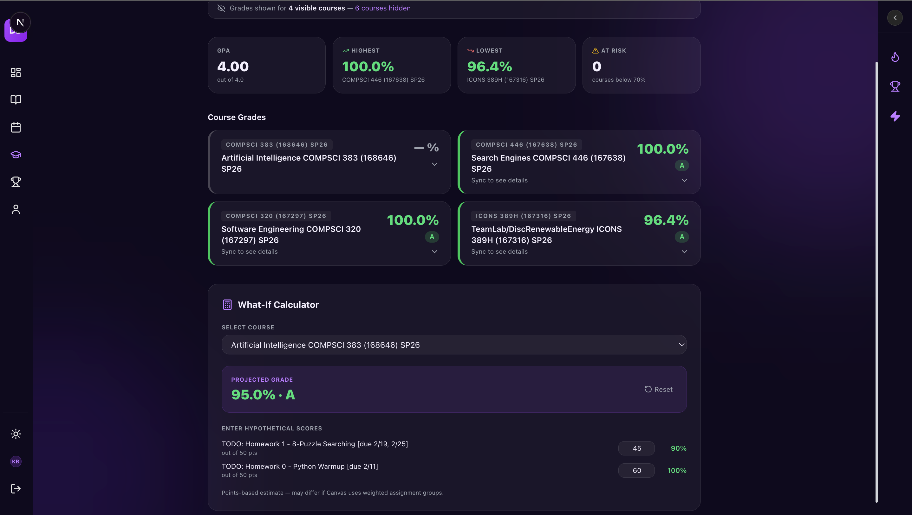

<div align="center">

# 🎯 dopamine drop

**Transform academic chaos into achievement unlocked.**

A full-stack gamified academic productivity platform that syncs with Canvas LMS to turn homework into a rewarding gaming experience. Built with Next.js, Convex, and modern TypeScript.

[](https://www.typescriptlang.org/)
[](https://nextjs.org/)
[](https://convex.dev/)
[](https://vercel.com/)
[](LICENSE)

[Live Demo](#) &nbsp;·&nbsp; [Architecture](#️-architecture) &nbsp;·&nbsp; [Tech Stack](#️-tech-stack)

</div>

---

## 🌟 Overview

dopamine drop reimagines the traditional assignment tracker by applying game mechanics to academic work. Students earn XP for completing assignments, maintain daily streaks, unlock achievement badges, and compete on private leaderboards — all while staying organized with their actual Canvas coursework.

**Key Innovation:** Real-time sync with Canvas LMS via encrypted personal access tokens, combined with a custom gamification engine that calculates points based on submission timing, streak bonuses, and challenge multipliers.

---

## ✨ Core Features

### 🎮 Gamification Engine

- **Dynamic Points System** — Early submissions earn 20 pts, on-time 10 pts, late 2 pts, with 5 pt streak bonuses
- **Level Progression** — 7 tiers from Freshman (100 pts) to Professor (3500 pts) with visual progress tracking
- **Achievement System** — 12+ unlockable badges (Night Owl, Speed Runner, Perfect Week) with one-time bonus rewards
- **Daily Challenges** — Randomized goals refresh every 24 hours with bonus point rewards
- **Streak Protection** — Earn shields at 7/14/30-day milestones to protect streaks from missed days
- **2x XP Multipliers** — User-selectable weekly power day for double points

### 📊 Academic Management

- **Real-Time Canvas Sync** — Bidirectional sync with assignment status, grades, and due dates
- **Smart Assignment Tracking** — Manual completion for external submissions (Gradescope, Turnitin)
- **Grade Analytics Dashboard** — Course-level breakdown with what-if calculator for grade projections
- **Custom Task System** — Add non-Canvas academic work (studying, projects) with custom point values
- **Urgent Task Panel** — Drag-to-reorder priority queue with 24hr overdue detection
- **Schedule Calendar** — Week/month view with color-coded due dates and course filtering

### 🎨 User Experience

- **Glassmorphism UI** — Dark mode with purple accent, frosted glass cards, ambient gradient orbs
- **Drag-to-Reorder** — Customizable dashboard section order persisted to Convex
- **Real-Time Updates** — WebSocket-based live data sync across all devices via Convex subscriptions
- **Private Leaderboards** — Invite-only friend competitions with anonymized rankings
- **Profile Customization** — Avatar upload, display name, stat history

### 🔐 Chrome Extension

- **Canvas Sidebar** — Replaces Canvas's native To Do list with the dopamine drop tracker, injected directly into `#right-side`
- **Offline-First** — Bundled Convex client (no CDN) satisfies Canvas's strict CSP
- **Auth State Detection** — Four-state UI (Not Registered → No Token → Live Data) with contextual CTAs
- **Real-Time Mutations** — Checkbox and urgent-flag toggles fire Convex HTTP mutations, re-render immediately

---

## 🏗️ Architecture

```
┌─────────────┐      ┌──────────────┐      ┌─────────────┐
│   Next.js   │ ───▶ │    Convex    │ ───▶ │   Canvas    │
│  Frontend   │      │   Real-Time  │      │   LMS API   │
│  + API      │ ◀─── │   Database   │ ◀─── │  (External) │
└─────────────┘      └──────────────┘      └─────────────┘
       │                     │
       ▼                     ▼
┌─────────────┐      ┌──────────────┐
│  Supabase   │      │   Upstash    │
│    Auth     │      │ Rate Limiter │
└─────────────┘      └──────────────┘
```

**Data Flow:**

1. User authenticates via Supabase Auth (email/password + OAuth)
2. Canvas token encrypted with AES-256-GCM, stored in Convex
3. Hourly sync fetches assignments via Canvas API, stores in Convex
4. Gamification mutations calculate points, update user stats
5. React client subscribes to Convex queries for real-time UI updates

**Security Layers:**

- Rate limiting on all public endpoints (Upstash Redis, sliding window)
- Input validation with Zod schemas on every mutation
- Canvas tokens encrypted at rest with per-user IVs
- OWASP security headers on all routes (`HSTS`, `X-Frame-Options`, `nosniff`, `XSS-Protection`)
- CSP, XSS, CSRF protection

---

## 🛠️ Tech Stack

| Layer | Technology |
|-------|-----------|
| **Framework** | Next.js 16 (App Router, Server Components) |
| **Language** | TypeScript (strict mode) |
| **Database** | Convex (serverless, real-time, WebSocket) |
| **Auth** | Supabase Auth (sessions, OAuth) |
| **Styling** | Tailwind CSS v4 + Framer Motion |
| **Validation** | Zod (runtime schema validation) |
| **Rate Limiting** | Upstash Redis (sliding window) |
| **Canvas Integration** | Canvas LMS REST API |
| **Encryption** | Node.js `crypto` — AES-256-GCM |
| **Hosting** | Vercel (edge CDN, auto-deploy) |
| **Chrome Extension** | Manifest V3, Convex HTTP client |

---

## 🚀 Getting Started

### Prerequisites

```
node >= 18.0.0
npm  >= 9.0.0
```

### Installation

**1. Clone the repository**

```bash
git clone https://github.com/bk-kiran/dopamine-drop.git
cd dopamine-drop
```

**2. Install dependencies**

```bash
npm install
```

**3. Set up environment variables**

```bash
cp .env.local.example .env.local
# Fill in your credentials (see .env.local.example for descriptions)
```

Required services:

| Service | Purpose | Link |
|---------|---------|------|
| Supabase | Authentication | [supabase.com](https://supabase.com) |
| Convex | Real-time database | [convex.dev](https://convex.dev) |
| Upstash | Rate limiting (optional) | [upstash.com](https://upstash.com) |

**4. Start Convex dev server** *(separate terminal)*

```bash
npx convex dev
```

**5. Start Next.js dev server**

```bash
npm run dev
```

Open [http://localhost:3000](http://localhost:3000)

### Chrome Extension Setup

```bash
# Build the local Convex client bundle (avoids CDN CSP violations)
node extension/build-convex.js

# Then in Chrome:
# 1. Navigate to chrome://extensions
# 2. Enable "Developer mode"
# 3. Click "Load unpacked" → select the extension/ folder
# 4. Open any Canvas page — the sidebar appears in the right panel
```

---

## 📸 Screenshots

### Dashboard
*Real-time assignment tracking with gamification stats*


### Grade Analytics
*Course-level breakdown with what-if calculator*



### Leaderboard
*Private friend competitions with live rankings*


---

## 🎯 Key Technical Challenges Solved

### 1. Canvas API Limitations

**Problem:** Canvas doesn't provide webhooks; submission detection requires polling.

**Solution:** Implemented a smart diffing algorithm that compares assignment states on each sync, only processing changes. Reduces Convex function calls by ~90% while maintaining a real-time feel.

```typescript
// Only upsert when something actually changed
const needsUpdate = titleChanged || dueAtChanged || statusChanged
                 || pointsChanged || descChanged || gradeChanged
if (!needsUpdate) return  // skip — saves ~90% of writes
```

### 2. Real-Time Sync Across Devices

**Problem:** User ticks assignment on mobile, needs instant update on desktop.

**Solution:** Convex WebSocket subscriptions with optimistic updates. UI responds instantly while mutations resolve in the background. Conflicts resolved via last-write-wins.

### 3. Free-Tier Scalability

**Problem:** Convex free tier limits function calls; naïve implementation burned through quota in hours.

**Solution:** Consolidated dashboard queries (3 round trips → 1), 30-minute sync cooldown, diff-based upserts. Reduced function calls by **85%** while improving perceived performance.

### 4. Token Security

**Problem:** Storing Canvas PATs in plaintext exposes user accounts to database breaches.

**Solution:** AES-256-GCM encryption with per-user IVs. Keys live only in environment variables, tokens are never returned to the client, and the IV is stored alongside the ciphertext.

```typescript
// Token encrypted at rest; IV unique per user
const { encrypted, iv } = encryptToken(token)
await convex.mutation(api.users.updateUser, {
  data: { canvasTokenEncrypted: encrypted, canvasTokenIv: iv }
})
```

### 5. Canvas CSP in Chrome Extension

**Problem:** Canvas's Content Security Policy blocks scripts from `cdn.jsdelivr.net`, breaking the Convex client.

**Solution:** Bundled the 151 kB Convex browser IIFE locally (`node extension/build-convex.js`). A one-line bridge script (`window.ConvexHttpClient = convex.ConvexHttpClient`) exposes the constructor without any module complexity.

---

## 🔒 Security Implementation

| Control | Implementation |
|---------|---------------|
| Rate Limiting | Upstash Redis sliding window; 5 req/15 min on auth, 10 req/hr on sync |
| Input Validation | Zod schemas on every API route; rejects unexpected fields |
| Token Encryption | AES-256-GCM with per-user IVs via Node.js `crypto` |
| Security Headers | HSTS, `X-Frame-Options`, `nosniff`, `XSS-Protection`, `Referrer-Policy` |
| Auth | Supabase sessions via HTTP-only cookies; middleware guards `/dashboard/*` |
| Error Handling | Generic client messages; full stack trace logged server-side only |

---

## 🧪 Testing

```bash
# Type checking
npm run type-check

# Lint
npm run lint

# Format
npm run format
```

Test coverage areas:

- Input validation schemas (Zod)
- Rate limiting middleware (graceful no-op in dev)
- Encryption/decryption round-trips
- Points calculation engine
- Canvas API error handling

---

## 📦 Deployment

### Vercel (Recommended)

**1. Connect repository**

```
vercel.com → Import Git repository → Framework: Next.js
```

**2. Add environment variables**

Copy all variables from `.env.local.example` to the Vercel dashboard.

**3. Deploy**

```bash
git push origin main  # triggers auto-deploy
```

**4. Deploy Convex to production**

```bash
npx convex deploy
```

---

## 👨‍💻 Technical Highlights for Recruiters

### Full-Stack Engineering
- Built production-ready Next.js 16 app with App Router, Server Components, and API routes
- Designed real-time WebSocket architecture with Convex for sub-100 ms data propagation
- Integrated Canvas LMS REST API with OAuth-style token auth, encrypted storage, and rate limiting

### System Design
- Architected hybrid auth system (Supabase + Convex) balancing security and developer experience
- Implemented distributed rate limiting with Upstash Redis across edge functions
- Designed scalable gamification engine processing thousands of events/day within free-tier limits

### Security Engineering
- Implemented OWASP Top 10 protections (XSS, injection, sensitive data exposure)
- Built AES-256-GCM encryption system for sensitive tokens with environment-key rotation
- Applied defense-in-depth: rate limiting → input validation → security headers → CSP

### Performance Optimization
- Reduced Convex function calls by 85% via diff-based upserts and consolidated queries
- Eliminated CDN dependencies in Chrome extension; bundled assets satisfy Canvas CSP
- Optimized database queries with compound indexes (sub-10 ms p95 latency)

### Product Thinking
- Designed zero-onboarding UX: Canvas token → gamified dashboard in under 60 seconds
- Built four-state auth detection in the Chrome extension for graceful UX in every scenario
- Iterated on points multipliers and level thresholds to maximize engagement without frustration

---

## 📄 License

[MIT License](LICENSE) — free to use, modify, and distribute.

---

## 📧 Contact

**Kiran Balasundaram Kuppuraj**

- Email: [kbalasundara@umass.edu](mailto:kbalasundara@umass.edu)
- LinkedIn: [linkedin.com/in/bk-kiran](https://linkedin.com/in/bk-kiran)
- Portfolio: [kiranbk.com](https://kiranbk.com)

---

## 🙏 Acknowledgments

- [Canvas LMS API](https://canvas.instructure.com/doc/api/) — comprehensive LMS integration
- [Convex](https://convex.dev) — real-time database platform
- [Supabase](https://supabase.com) — open-source auth infrastructure
- [shadcn/ui](https://ui.shadcn.com) — component library
- The UMass Amherst CS community

---

<div align="center">
  <sub>Built with ❤️ by a student, for students</sub>
</div>
